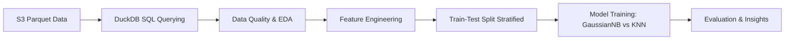

# 🚀 Hacker News'te Başarılı İçeriğin Anatomisi

## 🎓 Proje Hakkında & Teşekkür

Bu proje, **1-5 Haziran** tarihlerinde **Balıkesir Teknokent** ve **Global Maksimum Data & Information Technologies** iş birliğiyle gerçekleştirilen **Data & AI Bootcamp** programı kapsamında bitirme projesi (Datathon çalışması) olarak geliştirilmiştir.

5 günlük bu yoğun ve verimli süreçte:
- **Veri Odaklı Düşünme & Problem Çözme:** Gerçek dünya veri setleri üzerinde SQL ve Python ile uçtan uca veri analizi,
- **Makine Öğrenmesi & Modelleme:** Veri ön işleme, özellik mühendisliği (*feature engineering*), model eğitimi ve performans değerlendirme,
- **Veri Görselleştirme & Sunum:** İçgörü odaklı interaktif grafikler ve sunum becerileri geliştirilmiştir.

Eğitim sürecine katkıda bulunan tüm değerli eğitmenlerimize, organizasyon ekibine, **Balıkesir Teknokent** ve **Global Maksimum** ailelerine teşekkür ederim. 🚀

---

## 📌 Proje Özeti

Bu projede, teknoloji dünyasının en popüler topluluk platformlarından biri olan **Hacker News** üzerindeki gönderilerin ("story") başarı faktörleri analiz edilmiş ve bir gönderinin **viral (başarılı)** olup olmayacağını tahmin eden makine öğrenmesi modelleri geliştirilmiştir.

### 🎯 Temel Amaçlar
1. **Veri Analitiği & SQL:** S3 üzerinde parquet formatında saklanan ~147.000+ gönderiyi DuckDB SQL ile sorgulamak ve işlemek.
2. **Özellik Mühendisliği (Feature Engineering):** Başlık uzunluğu, paylaşım saati, özel etiketler (`Ask HN`, `Show HN`) ve URL varlığı gibi yeni öznitelikler türetmek.
3. **Keşifçi Veri Analizi (EDA):** Gönderi zamanlaması ve başlık yapısının puan/yorum oranları üzerindeki etkisini görselleştirmek.
4. **Sınıflandırma Modelleri:** Geliştirilen öznitelikler ile gönderinin viral olup olmadığını (Score $\ge 50$) tahmin eden modeller kurmak.

---

## 📊 Veri Seti Bilgileri

- **Veri Kaynağı:** S3 üzerindeki `hackernews.parquet` veri seti.
- **Kapsam:** Yalnızca `type = 'story'` olan ve başlığı eksiksiz olan gönderiler.
- **Toplam Gönderi Sayısı:** 147,137 adet.
- **Tarih Aralığı:** Ekim 2006 – Ocak 2020.
- **Hedef Değişken (`viral`):**
  - Gönderi Puanı (`score`) $\ge 50$ ise `1` (Viral)
  - Gönderi Puanı (`score`) $< 50$ ise `0` (Viral Değil)
- **Sınıf Dengesizliği (Class Imbalance):**
  - Viral Olmayan (`0`): 140,926 gönderi (%95.78)
  - Viral Olan (`1`): 6,211 gönderi (%4.22)

---

## 🛠️ Kullanılan Teknolojiler ve Kütüphaneler

- **Veri Sorgulama:** `DuckDB` (S3 parquet direct querying)
- **Veri İşleme ve Analiz:** `Pandas`, `NumPy`
- **İnteraktif Görselleştirme:** `Plotly Express`
- **Makine Öğrenmesi:** `Scikit-Learn` (`GaussianNB`, `KNeighborsClassifier`, `train_test_split`, `metrics`)

---

## ⚙️ Proje Adımları & İş Akışı



### 1. Veri Edinimi ve Temizliği
- S3 parquet dosyasından DuckDB ile `title`, `score`, `descendants`, `time`, `url` alanları seçildi.
- Veri kalitesi denetlendi; eksik değerler (`url` dışındaki alanlarda eksik yok) ve veri tipleri incelendi.

### 2. Özellik Mühendisliği (Feature Engineering)
| Özellik | Açıklama | Tip |
| :--- | :--- | :--- |
| `title_length` | Gönderi başlığının karakter uzunluğu | Sayısal |
| `hour` | Gönderinin paylaşıldığı saat (0-23 UTC) | Sayısal |
| `is_ask_hn` | Başlığın "Ask HN" ile başlayıp başlamadığı | Binary (0 / 1) |
| `is_show_hn` | Başlığın "Show HN" ile başlayıp başlamadığı | Binary (0 / 1) |
| `has_url` | Gönderinin harici bir URL içerip içermediği | Binary (0 / 1) |
| **`viral` (Target)** | Puan $\ge 50$ durumu | Binary (0 / 1) |

### 3. Keşifçi Veri Analizi (EDA) Öne Çıkan Bulgular
- **Paylaşım Saati:** Günün belirli saatlerinde (özellikle 13:00 - 18:00 UTC arası) yapılan paylaşımların ortalama puanı ve viral olma oranı daha yüksektir.
- **Gönderi Türleri:** `Ask HN` ve `Show HN` gönderilerinin yorum etkileşimi yüksek iken, harici URL içeren teknik/haber içeriklerinin yüksek puan alma potansiyeli öne çıkmaktadır.
- **Başlık Uzunluğu:** Çok kısa veya aşırı uzun başlıklar yerine orta uzunluktaki (30-60 karakter) başlıklar daha kararlı etkileşim yakalamaktadır.

---

## 🤖 Makine Öğrenmesi Modelleri ve Performans

Veri seti %80 Eğitim (117,709 örnek) ve %20 Test (29,428 örnek) olarak, `stratify=y` yöntemiyle sınıf oranları korunarak bölünmüştür.

### Model Karşılaştırması

| Model | Accuracy (Doğruluk) | Precision (Viral-1) | Recall (Viral-1) | F1-Score (Viral-1) |
| :--- | :---: | :---: | :---: | :---: |
| **Gaussian Naive Bayes** | **%94.15** | 0.09 | **0.04** | **0.05** |
| **K-Nearest Neighbors (k=5)** | **%95.75** | 0.00 | 0.00 | 0.00 |

### 🎯 Önemli Model İçgörüleri & Değerlendirme
1. **Accuracy Yanılsaması (Accuracy Paradox):**
   - Veri setindeki baskın sınıf dengesizliği nedeniyle (%95.78 viral olmayan), KNN modeli tüm test örneklerini "Viral Değil (0)" olarak tahmin etse dahi **%95.75** doğruluk oranına ulaşmaktadır. Ancak KNN pozitif sınıfı (`viral=1`) hiç yakalayamamıştır (Recall = 0.00).
2. **Gaussian Naive Bayes Başarısı:**
   - GaussianNB %94.15 accuracy almasına rağmen pozitif sınıftan (viral gönderiler) bazılarını tespit edebilmiştir (50 doğru pozitif).
3. **Çıkarım:**
   - Dengesiz veri setlerinde yalnızca Accuracy metriğine odaklanmanın yanıltıcı olduğu; Precision, Recall, F1-Score ve Karmaşıklık Matrisi (*Confusion Matrix*) analizinin hayati öneme sahip olduğu kanıtlanmıştır.

---

## 💻 Projeyi Çalıştırma

### Gereksinimler
Gerekli Python kütüphanelerini yüklemek için:

```bash
pip install duckdb pandas numpy plotly scikit-learn
```

### Notebook'u Çalıştırma
Jupyter Notebook ortamında [final_datathon.ipynb](file:///c:/Users/Taner/Documents/code/bauntek_data_boot_final/final_datathon.ipynb) dosyasını açıp hücreleri sırasıyla çalıştırabilirsiniz:

```bash
jupyter notebook final_datathon.ipynb
```

---

<p center="align">
  <i>Bu proje <b>Balıkesir Teknokent x Global Maksimum Data & AI Bootcamp</b> bünyesinde geliştirilmiştir.</i> 🌟
</p>
